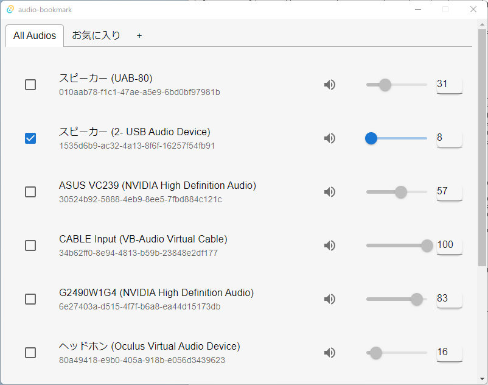
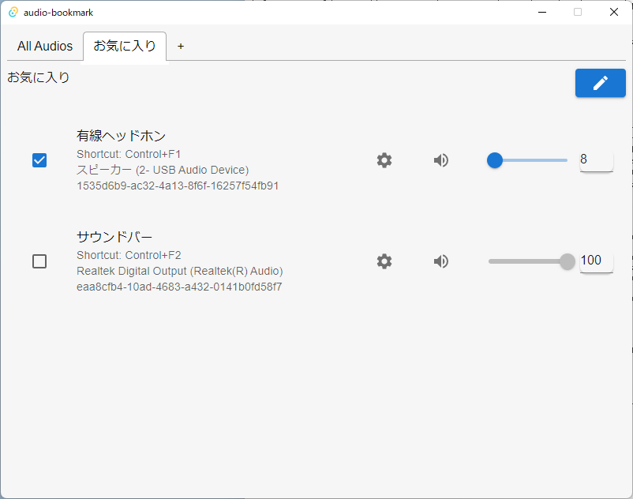
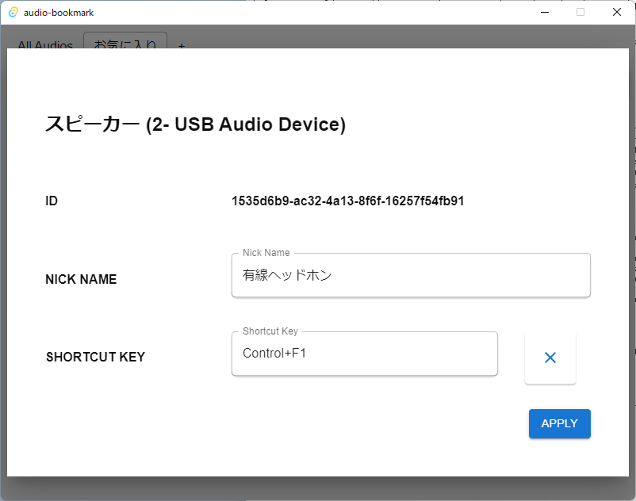
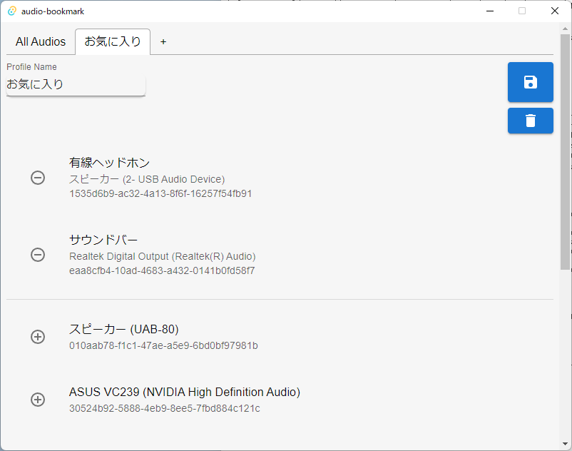

# audio-bookmark

audio-bookmarkはお気に入りの出力オーディオに別名をつけ管理できるユーティリティアプリです！

- 普段使うオーディオだけをまとめたプロファイルを作れます
- プロファイルでオーディオにニックネームをつけられます
- ショートカットキー(ホットキー)を設定できます
- ついでに音量調節とミュートもできます

リリースページ: https://github.com/anotherhollow1125/audio-bookmark/releases

ダウンロード: https://github.com/anotherhollow1125/audio-bookmark/releases/download/v0.0.0/audio-bookmark_0.0.0_x64_en-US.msi

## 使い方

本アプリを開くと、手持ちのオーディオ全てが表示されたAll Audioタブが開かれています。

オーディオをクリックするとデフォルトオーディオが切り替わります。また、アクティブになっているオーディオは右側のアイコンとスライダーからミュート切り替えと音量調整が可能です。

### Profile

All Audioタブの右側にある`+`を押すことで、お気に入りのオーディオをまとめるプロファイルを作成できます。

プロファイルでは各オーディオについて、All Audioタブでできたことの他に「ニックネーム設定」と「ホットキー設定」が可能になります。

- NICK NAME: プロファイルでの表示名を変更できます。空欄にすることで元の名前に直せます。
- SHORTCUT KEY: 希望のショートカットキーを押すことで設定できます。

プロファイル名の変更と、プロファイルに含めるオーディオは右側の :pencil: から編集できます。

